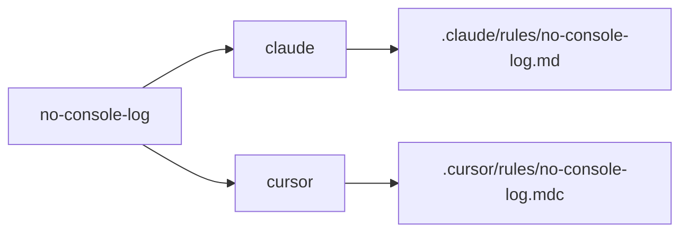
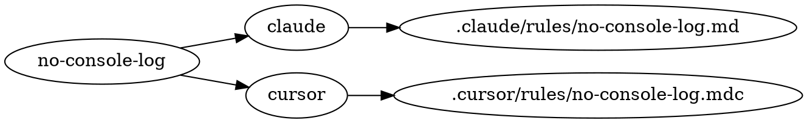

# graph

Render the spec to target to file dependency graph for the current project.

`graph` walks the loaded spec bundle, asks every configured target adapter which files each spec produces, and prints the result. Read-only: it never invokes Emit on disk. Output is deterministic, sorted by spec name then target.

## Synopsis

```bash
agnostic-ai graph [flags]
```

## Flags

| Flag | Description |
|------|-------------|
| `--format <text\|mermaid\|dot\|json>` | Output format. Default `text`. |
| `--target <name>` | Restrict to one target. |
| `--spec <name>` | Restrict to one spec name. |
| `--kind <kind>` | Restrict to one kind (`agent`, `skill`, `rule`, `hook`, `mcp`, `command`). |

## Formats

### text (default)

Aligned matrix. Rows are specs, columns are targets. Each cell is the kind that target emits, or `-` when nothing was produced.

```text
spec           | claude cursor codex
code-reviewer  | agent  agent  agent
no-console-log | rule   rule   rule
other          | rule   rule   rule
```

### mermaid

`graph LR` for embedding in markdown docs.



### dot

Graphviz directed graph. Pipe to `dot(1)` for SVG/PNG.

```bash
agnostic-ai graph --format dot | dot -Tsvg > graph.svg
```



### json

One record per edge, for editor extensions and scripts.

```json
[
  {
    "spec": "no-console-log",
    "kind": "rule",
    "target": "claude",
    "path": ".claude/rules/no-console-log.md"
  }
]
```

## Examples

```bash
# Default matrix view
agnostic-ai graph

# Only the claude column
agnostic-ai graph --target claude

# One spec across every target
agnostic-ai graph --spec no-console-log

# Only rule-kind edges, as JSON
agnostic-ai graph --kind rule --format json

# Render an SVG of the whole graph
agnostic-ai graph --format dot | dot -Tsvg > graph.svg
```

## See also

- [`render`](cli-reference.md#render) prints the file content for one spec, per target.
- [`explain`](cli-reference.md#explain) lists every output file and section a single spec contributes to.
